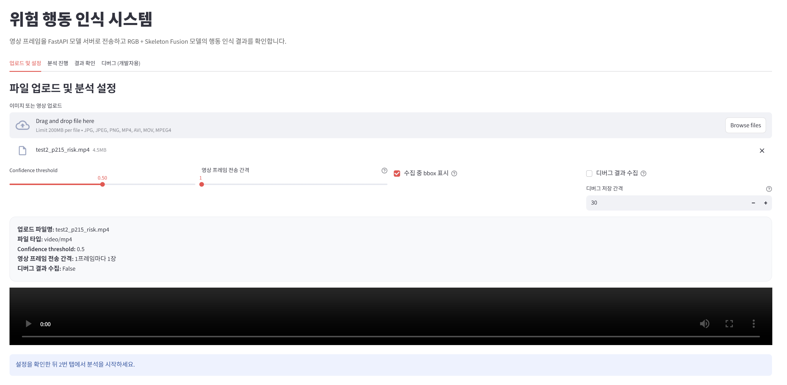
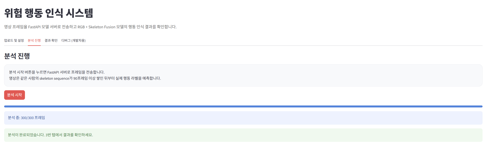
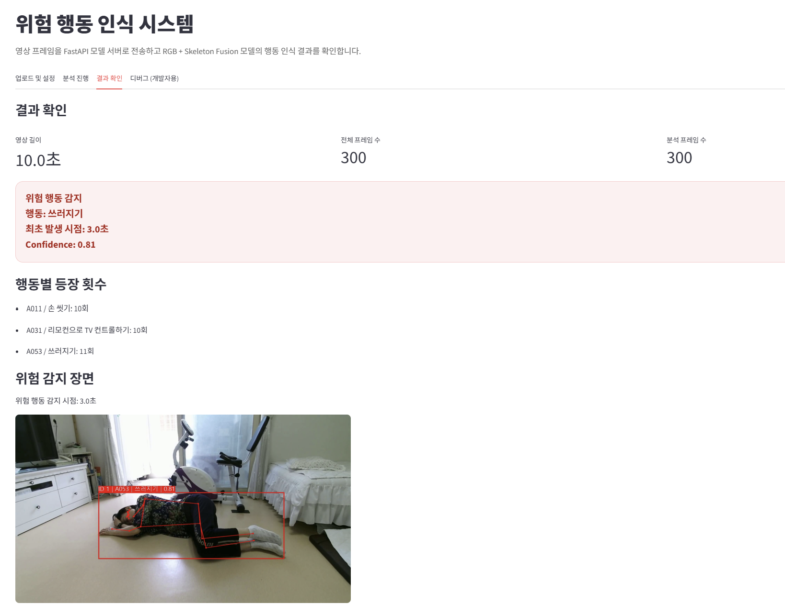
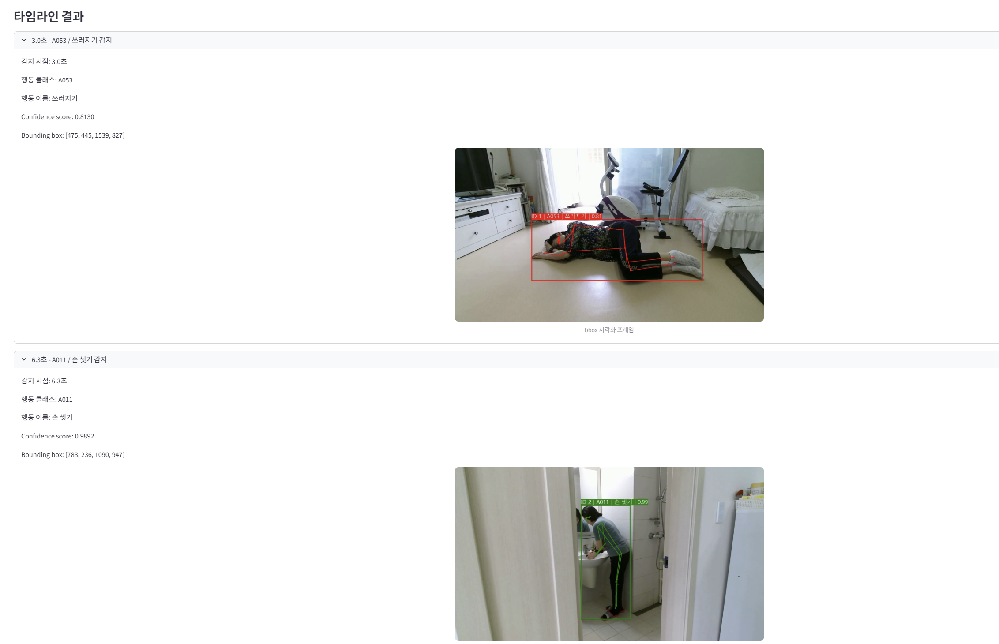

# 살핌(SALPIM): RGB + Skeleton Fusion 기반 고령자 행동 인식 시스템

## 1. 프로젝트 소개

SALPIM은 고령자의 일상 행동을 인식하고 낙상(Fall Down)과 같은 위험 행동을 분류하기 위한 행동 인식 프로젝트이다.

본 프로젝트는 ETRI 고령자 행동 데이터셋을 활용하여 RGB 영상 정보와 Skeleton 관절 정보를 함께 사용하는 Fusion 모델을 구축하였다. 또한 실시간 추론 환경을 고려하여 YOLO 기반 사람 탐지, MediaPipe Pose 기반 관절 추출, ONNX 기반 추론 파이프라인을 구현하였다.

### 주요 기능

* 고령자 행동 분류 및 위험 행동 탐지
* RGB + Skeleton Fusion 기반 행동 인식
* ByteTrack 기반 인물 ID 유지 (실시간 추론 환경)
* Streamlit 기반 웹 UI 제공
* FastAPI 기반 추론 서버 구축
* 행동 클래스별 Confidence Score 출력
* Bounding Box 및 Pose 시각화
* Threshold 조절 인터랙션 기능

---

## 2. 프로젝트 실행 화면

### 1) 업로드 및 설정 화면

- 이미지 및 영상 업로드
- Confidence Threshold 설정
- 프레임 전송 간격 설정
- Bounding Box 표시 옵션 설정



---

### 2) 분석 진행 화면

- FastAPI 서버로 프레임 전송
- 실시간 분석 진행 상황 표시
- 90프레임 Sequence 누적 및 행동 예측 수행



---

### 3) 결과 확인 화면

- Bounding Box 및 Skeleton 시각화
- 행동 클래스 및 Confidence Score 출력
- 위험 행동 감지 결과 표시
- 위험 행동 발생 시점 확인


- 행동 변화 타임라인 제공


---

## 3. 개발 환경 및 의존성

### Development Environment

* Python 3.11
* Google Colab
* PyTorch
* ONNX Runtime
* OpenCV
* MediaPipe
* Streamlit

### 주요 라이브러리

```bash
torch
torchvision
numpy
opencv-python
mediapipe
ultralytics
onnx
onnxruntime
streamlit
```

---

## 4. 데이터 파이프라인

### 데이터셋

ETRI 고령자 일상행동 인식 데이터셋 사용

### 사용 행동 클래스

| ID | 행동            |
| -- | ------------- |
| 10 | 이빨 닦기         |
| 11 | 손 씻기          |
| 16 | 머리 빗기         |
| 18 | 상의 입기         |
| 23 | 진공청소기 사용하기    |
| 31 | 리모컨으로 TV 제어하기 |
| 35 | 전화 걸기 및 받기    |
| 41 | 맨손 체조하기       |
| 53 | 쓰러지기          |
| 54 | 누워있다 일어나기     |

### RGB 데이터 전처리

* 원본 영상을 10 FPS로 프레임 추출
* 입력 크기 224×224로 통일
* 정규화(Normalization) 적용
* Person ID 기반 Train / Validation / Test 분할
* RGB Frame Dataset 생성

### Skeleton 데이터 전처리

ETRI RGB 영상으로부터 Skeleton 데이터를 추출하여 행동 인식 모델 학습에 적합한 형태로 전처리하였다.

* MediaPipe Pose를 이용하여 주요 관절 좌표 추출
* Hip Center 기준 상대 좌표 정규화 및 Body Scale 정규화 적용
* 결측치 보간(Interpolation) 및 Moving Average Smoothing 수행
* Velocity Feature(vx, vy, vz) 생성
* 모든 시퀀스 길이를 90프레임으로 통일
* Person ID 기반 Train / Validation / Test 분할
* 최종 입력 형태 (90, 17, 6) 구조로 구성 ([x, y, z, vx, vy, vz])

---

## 5. 시스템 아키텍처

```text
영상 입력
    ↓
YOLO Person Detection
    ↓
MediaPipe Pose
    ↓
Skeleton 생성
    ↓
RGB + Skeleton Fusion Model
    ↓
행동 분류 결과 출력
```

### 실시간 추론 파이프라인

```text
영상 입력
    ↓
YOLO Person Detection
    ↓
ByteTrack Tracking
    ↓
MediaPipe Pose
    ↓
Skeleton 생성
    ↓
Fusion ONNX Inference
    ↓
행동 예측 결과 출력
```

※ 학습 단계에서는 ETRI RGB 및 Skeleton 데이터를 활용하여 행동 분류 모델을 학습하였으며, ByteTrack은 실시간 추론 단계에서 인물 ID 유지를 위해 적용하였다.

---

## 6. 모델 구조

### Baseline Models

* Skeleton Only Baseline: ST-GCN 기반 Skeleton 행동 분류 모델
* RGB Only Baseline: ResNet18 기반 RGB 행동 분류 모델

### Final Model

RGB 영상 특징과 Skeleton 특징을 결합한 Fusion 모델 사용

#### RGB Branch

* ResNet18 Backbone
* RGB Feature 추출

#### Skeleton Branch

* ST-GCN
* Skeleton Feature 추출

#### Fusion Head

* RGB Feature + Skeleton Feature 결합
* Fully Connected Layer 기반 행동 분류

---

## 7. 성능 결과

### 행동 분류 성능 비교

| Model                 | Accuracy |
| --------------------- | -------- |
| ST-GCN                | 67.25%   |
| RGB Only              | 66.67%   |
| RGB + Skeleton Fusion | 75.44%   |

### 추론 성능

| 항목              | 결과       |
| ----------------- | --------- |
| Full Pipeline FPS | 12.38 FPS |

※ FPS는 YOLO Person Detection, ByteTrack Tracking,
MediaPipe Pose, Skeleton 생성, Fusion 모델 추론을 포함한 
전체 파이프라인 기준으로 측정하였다.

---

## 8. 설치 방법

### 1) Repository Clone

```bash
git clone https://github.com/yoyoori/salpim_tracking_project.git
cd salpim_tracking_project
```

### 2) Python 가상환경 생성

> ※ Python 3.11 환경을 권장합니다.

```bash
python -m venv venv
```

**Windows**

```bash
venv\Scripts\activate
```

**Linux / Mac**

```bash
source venv/bin/activate
```

### 3) 라이브러리 설치

```bash
pip install -r requirements.txt
```

### 4) 모델 파일 확인

다음 파일이 `models` 폴더에 존재해야 합니다.

```text
models/
├── fusion_mediapipe_pose_best.pth
├── full_fusion_single.onnx
└── label_map.json
```

### 5) 실행 환경

* Python 3.11 권장
* Windows 10 / Windows 11 환경에서 테스트
* Python 3.12 이상에서는 일부 라이브러리(MediaPipe, ONNX Runtime) 설치 오류가 발생할 수 있습니다.

---

## 9. 실행 방법

### 1) FastAPI 서버 실행

먼저 터미널을 열고 FastAPI 서버를 실행합니다.

```bash
uvicorn api:app --reload
```

기본 주소:

```text
http://127.0.0.1:8000
```

### 2) Streamlit 웹 애플리케이션 실행

새 터미널을 열고 Streamlit 애플리케이션을 실행합니다.

```bash
streamlit run app.py
```

기본 주소:

```text
http://localhost:8501
```

### 3) 사용 방법

1. Streamlit 웹 페이지 접속
2. 이미지 또는 영상 업로드
3. Confidence Threshold 설정
4. 프레임 전송 간격 설정
5. 분석 시작 버튼 클릭
6. 행동 인식 결과 및 위험 행동 감지 결과 확인

### 실행 순서

```text
터미널 1
↓
uvicorn api:app --reload

터미널 2
↓
streamlit run app.py

브라우저 접속
↓
http://localhost:8501
```
---

## 10. 프로젝트 구조

```text
salpim_trackig_project/
├── assets/
│   └── alarm.wav
│
├── models/
│   ├── fusion_mediapipe_pose_best.pth
│   ├── full_fusion_single.onnx
│   └── label_map.json
|
├── models/
│   ├── fusion_mediapipe_pose_best.pth
│   ├── full_fusion_single.onnx
│   └── label_map.json
|
├── notebooks/
│   ├── 01_skeleton_preprocessing.ipynb
│   ├── 02_rgb_preprocessing.ipynb
│   ├── 03_gru_baseline.ipynb
│   ├── 04_stgcn_baseline.ipynb
│   ├── 05_rgb_only_baseline.ipynb
│   ├── 06_fusion_feature_extract.ipynb
│   ├── 07_fusion_training.ipynb
│   └── 08_fusion_inference.ipynb
│
├── api.py
├── app.py
├── yolov8n.pt
├── requirements.txt
├── docs/
├── requirements.txt
└── README.md
```

---

## 11. 팀원 역할 분담

### 팀원 1 김유리

* Skeleton 및 RGB 데이터 전처리
* Streamlit 웹 UI 구성 및 FastAPI 연동
* 데모 영상 제작 및 실시간 영상 처리 최적화
* 위험 상황 알림 기능 및 이벤트 로그 구현
* Tracking 성능 측정 및 평가 지표 분석
* 최종 보고서 작성 및 발표 진행

### 팀원 2 명지민

* ST-GCN, RGB Baseline 모델 개발 및 성능 비교
* RGB + Skeleton Fusion 모델 설계 및 학습
* YOLO, MediaPipe Pose, ByteTrack 기반 실시간 추론 파이프라인 구현
* ONNX 변환 및 추론 최적화
* 행동 인식 모델 성능 평가 및 실험 결과 분석
* Github 코드 정리


